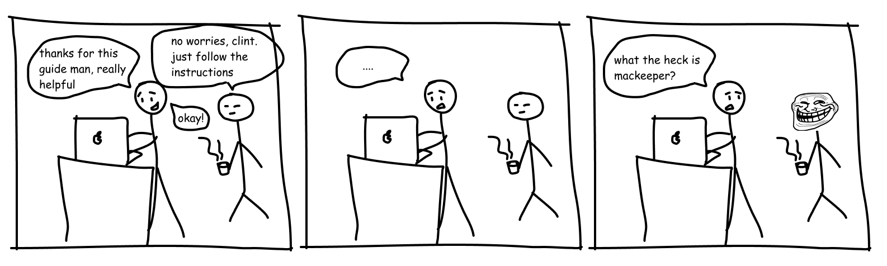

# Introduction

This quick guide was initially written with the intent of setting up a UI development environment for product designers which was previously adopted at [Symph](https://www.symph.co) and [Abstract Digital](https://abstract.ph/). Now, I'm sharing it to the world to help super-charge other design teams, and for everyone who loves to ship digital products! 🚀

If you feel that:

* You want to have a consistent dev environment for your design team ⚡
* You're a designer who needs easy instructions in setting up dev stuff in your machine 💻
* You're a designer who wants to flex how cool your terminal looks like 💪

Then this guide might be for you.&#x20;

Feel free to use this guide – share it or fork it. No need to strictly follow it. This guide is designed for our workflow and tech stack in the company, so please do feel free to augment it according to your needs. 🦄✨
