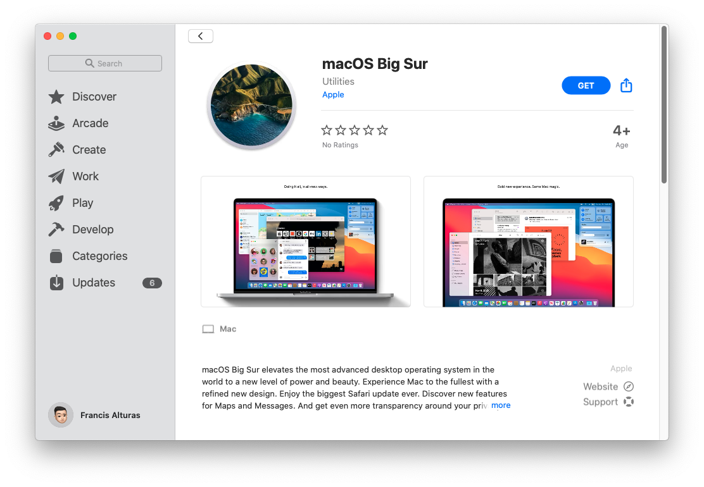
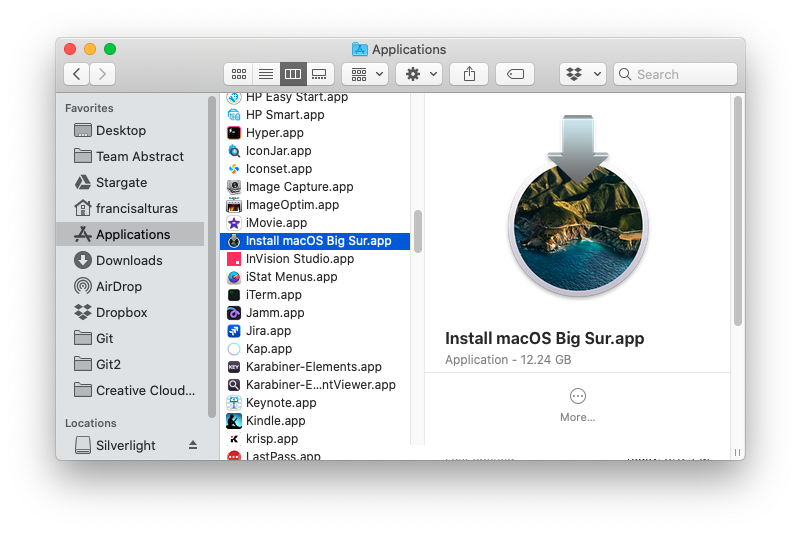
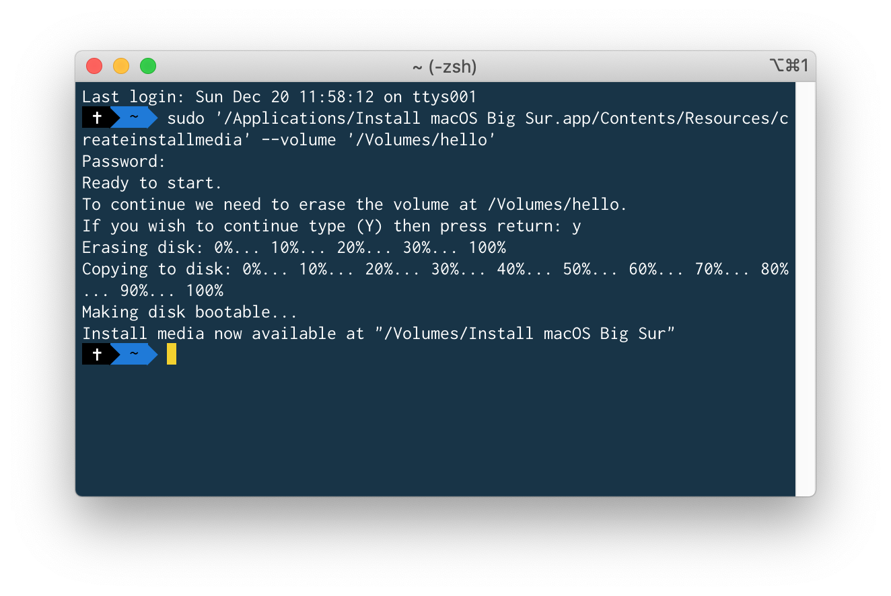

# Installing macOS

## Fresh Install, Is Best Install

I usually prefer wiping out my whole hard drive and just doing a fresh install. I've done macOS upgrades in the past but I still feel the bloat after two continuous OS upgrades. So let's create a bootable macOS installer!

First, download the latest macOS via App Store:



## Creating A Bootable Installer

There are numerous apps and ways to create a bootable macOS install. As of this writing, [Disk Maker X](https://diskmakerx.com/) no longer supports Big Sur. But you can still easily do this on your Terminal. Here's how you create a bootable thumb drive:

* Prepare a 16GB usb thumb drive that's ready to be wiped out
* Make sure you already have downloaded macOS Big Sur. After downloading, It should be sitting on your Applications folder like this:



* Insert your thumbdrive and simply run this command below on your terminal. Make sure you replace "**Untitled"** with the name of your usb thumb drive.

```text
sudo '/Applications/Install macOS Big Sur.app/Contents/Resources/createinstallmedia' --volume '/Volumes/Untitled'
```

* Wait for around 10-15 minutes to complete. You should see this after completing it:



## Backup Checklist

* [ ] Files on the **Downloads** folder
* [ ] Files on the **Desktop** folder
* [ ] Files on the **Documents** folder I recommend Google Docs/Sheets
* [ ] Files on the **Pictures** folder  I recommend Google Photos
* [ ] Your **Git** folder I recommend Github or Bitbucket
* [ ] Quick code snippets / links / random texts  Instead of saving them on icloud notes or on sublime text/note taking apps - use [Paste](https://pasteapp.me/)! 
* [ ] Browser bookmarks, settings, history, ect.   If you're using different browsers, [Raindrop.io](https://raindrop.io/) is a great bookmarks manager.
* [ ] Passwords, Server logins, sensitive-stuff.  \(Don't store them in your notes. Use password generators like [1Password](https://1password.com/). I recommend [LastPass](https://www.lastpass.com/)\)
* [ ] Don't forget to backup your public ssh keys too
* [ ] Your saved typefaces

## Cloud Storage

Before, I used to back everything up to an external hard drive. Now, I sync all my files to the cloud. [Dropbox](https://www.dropbox.com/) is great \(And right-clicking to share public links works like a charm\). But I'm seeing [Google One ](https://one.google.com/)as a more economically viable option. And if you're living on an Apple ecosystem, [iCloud](https://www.apple.com/ph/icloud/) might make sense for you. 
















**Warning** There's no going back after this point, so be sure to backup your files to the cloud. And if you don't feel comfortable with it, just do a manual backup using your external hard drive.


## Let The Purge Begin

Now it's time to take a deep breath, shutdown your machine, and hope there won't be regrets. 🐵

Insert the bootable USB and upon pressing the power key, **hold the option key** until it loads up a screen which prompts you to choose which device you want to boot from. So select the thumb drive with the macOS installer.


Select **Disk Utility** and click **Continue**. 


Next thing you wanna do is clear out your hard drive by clicking on the your Internal SSD Drive \(_APPLE SSD SM05_.. in this example\) and hitting Erase. This will reformat your drive. Choose **Apple File System \(APFS\).** After that, go back and click on Reinstall OS X.


There's are reported issues with macOS Catalina where it does fully erase the whole drive. If that happens, follows these steps below. \(Thanks for the heads up [@jermaineldilao](https://jermainedilao.github.io/)\)

* open Disk Utility
* go to view menu and check the "show All Devices"
* You will see some options \(Macintosh HD\) on Container-disk1 and one of them is unmounted \(Macintosh HD - Data\). select that one and mount it.
* finally restart your Mac


After that, the process is pretty much straightforward into a series of clicking next.

