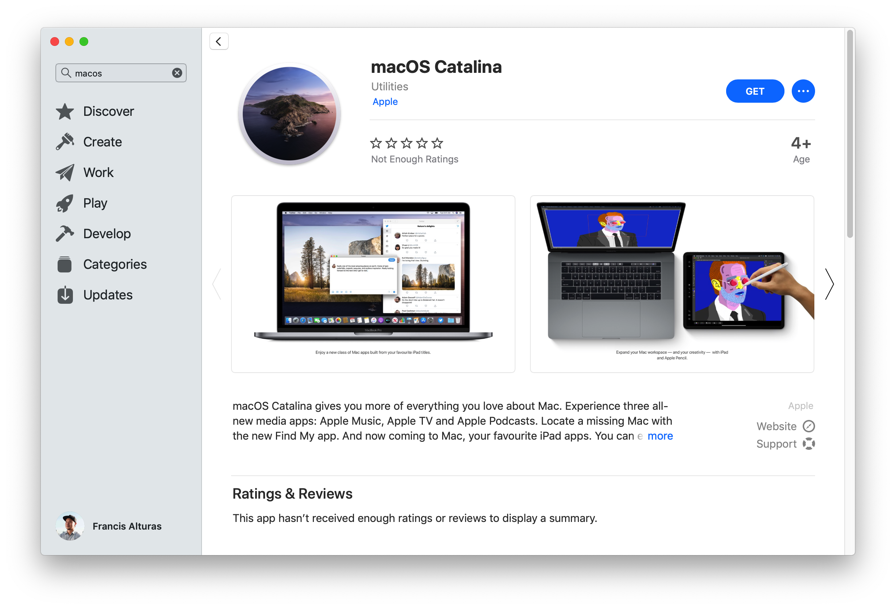
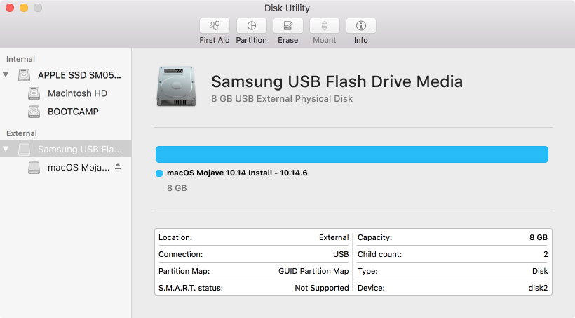

# Installing macOS

## Fresh Install, Is Best Install

I usually prefer wiping out my whole hard drive and just doing a fresh install. I've done macOS upgrades in the past but I still feel the bloat. So let's create a bootable macOS installer!

First, download the latest macOS via App Store:

There are numerous apps and ways to create a bootable macOS install, but the fastest and easiest way I've tried is thru [Disk Maker X](https://diskmakerx.com/). Also, Don't forget to prepare an 8GB thumb drive that's ready to be wiped out clean. Instructions are fairly straight forward on creating a bootable installer.


**Warning** There's no going back after this point, so be sure to backup your files to the cloud like [Google One](https://one.google.com/about) or [Dropbox](https://www.dropbox.com/). And if you don't feel comfortable with it, just do a manual backup using your external hard drive.


#### A nice list of things to remember when backing up

* [ ] Important documents \(This is why I recommend using Google Docs/Sheets\)
* [ ] Family photos \(Everything is on Google Photos\)
* [ ] Code files \(Lol, no worries - these should be in the repositories like Github or Bitbucket\)
* [ ] Quick code snippets / links / random texts \(Instead of saving them on icloud notes or on sublime text/note taking apps - use [Paste](https://pasteapp.me/)! \)
* [ ] Browser bookmarks, ect \(Create a Google account to login to chrome\)
* [ ] Passwords, Server logins, sensitive-stuff. \(Use password generators like 1Password\)
* [ ] Don't forget to backup your public keys too

## Let The Purge Begin

Now it's time to take a deep breath, shutdown your machine, and hope there won't be regrets. 🐵

Insert the bootable USB and upon pressing the power key, **hold the option key** until it loads up a screen which prompts you to choose which device you want to boot from. So select the thumb drive with the macOS installer.

Select **Disk Utility** and click **Continue**. 

Next thing you wanna do is clear out your hard drive by clicking on the your Internal SSD Drive and hitting Erase. This will reformat your drive. Choose **Apple File System \(APFS\).** After that, go back and click on Reinstall OS X.

After that, the process is pretty much straightforward into a series of clicking next.

