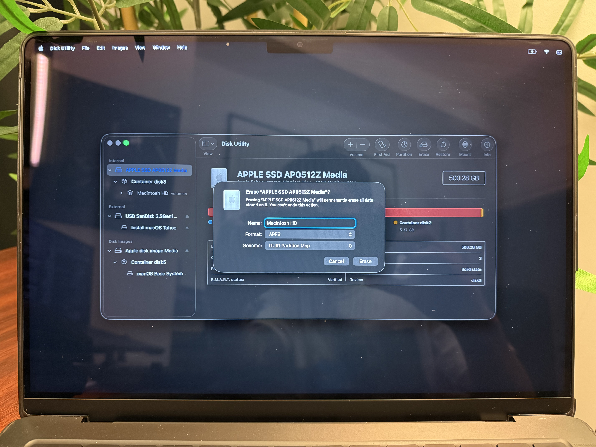
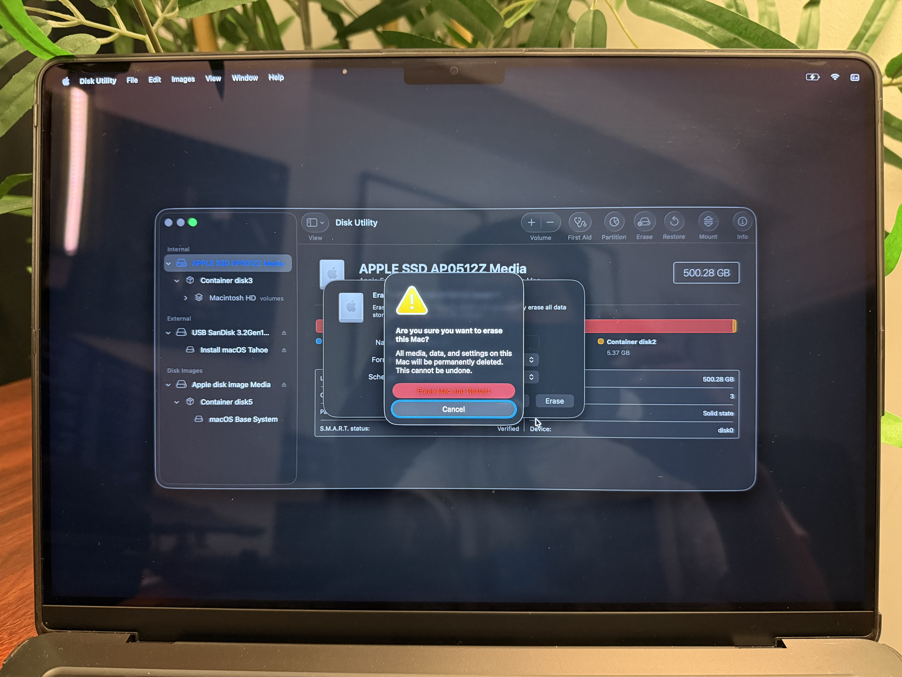
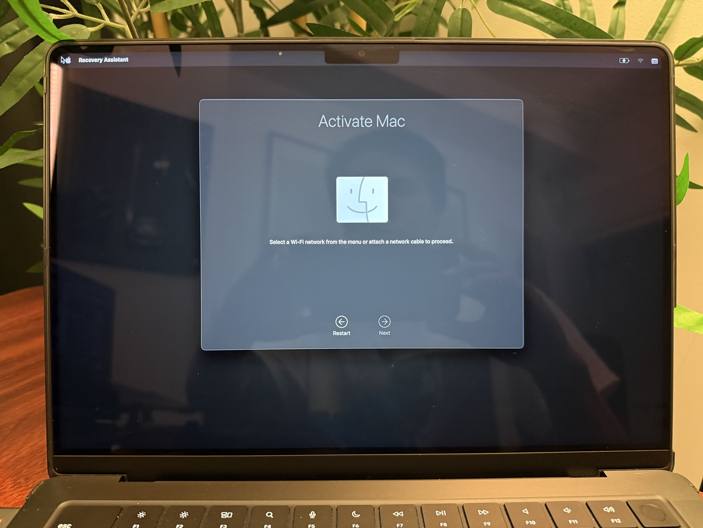
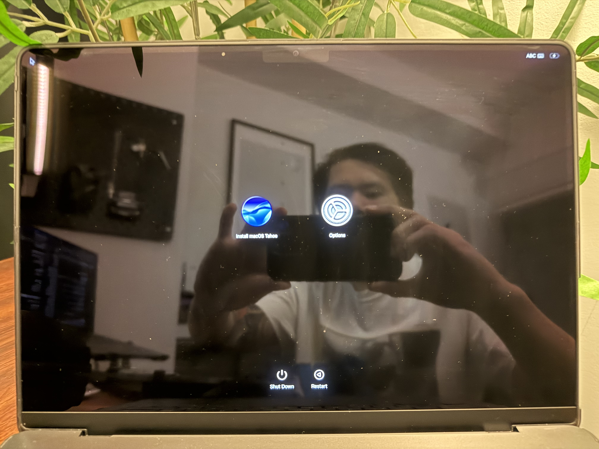
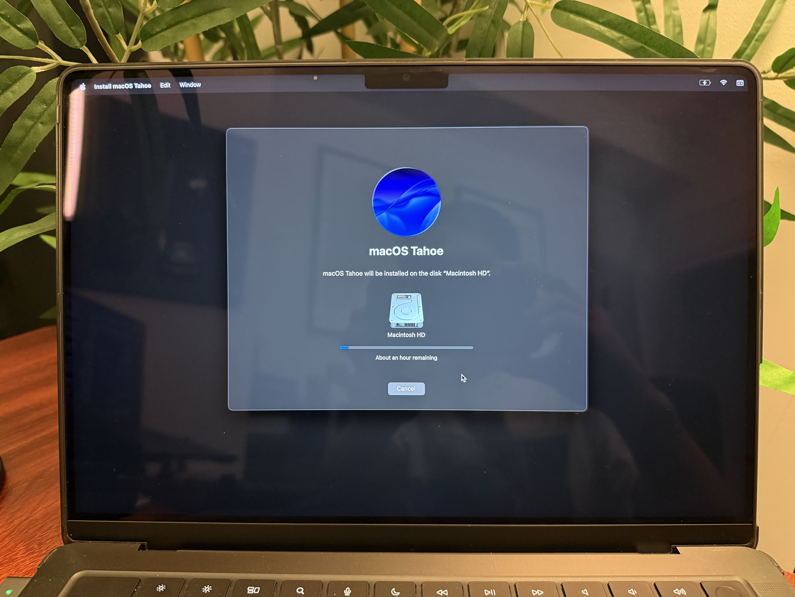

# Installing macOS

I usually prefer wiping out my whole hard drive and just doing a fresh install. I've done macOS upgrades in the past but I still feel the bloat after two continuous OS upgrades (And all those annoying temporary/hidden files that take up space). So, let's create a bootable macOS installer!

## Download macOS Tahoe

You can no longer download the macOS Tahoe directly from the AppStore as of this writing. But you can&#x20;


1. Open Terminal

```zsh
softwareupdate --list-full-installers
```

&#x20;And you'll see something like this:

<figure><figcaption></figcaption></figure>

2. Run the command below and replace the version with the latest one you see on the list:

```zsh
softwareupdate --fetch-full-installer --full-installer-version 26.3.2
```

3. After downloading, you'll find it in your **Applications** folder

<figure><figcaption></figcaption></figure>

## Create a Bootable USB Installer

Once downloaded:

1. Insert a 16GB+ USB drive
2.  Format it using Disk Utility

    * Format: **Mac OS Extended (Journaled)**
    * Scheme: **GUID Partition Map**

    <figure><figcaption></figcaption></figure>
3. Then run this command:

```zsh
sudo /Applications/Install\ macOS\ Tahoe.app/Contents/Resources/createinstallmedia --volume /Volumes/MyUSB
```

## Boot From the USB&#x20;


**Warning:** There's no going back after this point, so be sure to back up your files to the cloud. If you’re not comfortable with that, you can always do a manual backup using your external hard drive.


Let the purge begin! 🐵

Shut down your the Mac. Plug in the USB. Press and hold the power button. And wait until you see:

> “Loading startup options…”

A screen will appear asking you which device you want to boot from.&#x20;

* Select **Options** → **Continue**
* You’ll enter macOS Recovery (You might be asked to enter your login password)
* From the menu choose **Disk Utility**

<figure><figcaption></figcaption></figure>

#### Then wipe the disk

* In Disk Utility click **View** → **Show All Devices**

<figure><figcaption></figcaption></figure>

* Select the top internal disk (It's the Storage Device, usually something like _Apple SSD_).
* Click **Erase**
  *   Then use these settings:

      * Name: Macintosh HD
      * Format: APFS
      * Scheme: GUID Partition Map


      <figure><figcaption></figcaption></figure>

You'll be presented with some prompts. Click on **Erase Mac...** →  **Erase Mac and Restart**

<figure><figcaption></figcaption></figure>

Your machine will reboot. Once done, you'll see an **Activate Mac** screen. Connect to the internet and click **Next. In the Activation Lock screen, y**ou'll need to enter some details to activate your mac. Once done, tap on **Exit to Recovery**.

<figure><figcaption></figcaption></figure>

Since you're booting from **Recovery Mode**, you won't see the macOS Tahoe installer here. Shutdown your computer, and boot again from your USB by long pressing the power button.<br>

Now select **Install macOS Tahoe**

<figure><figcaption></figcaption></figure>

Then follow the rest of the installation process!

<figure><figcaption></figcaption></figure>
