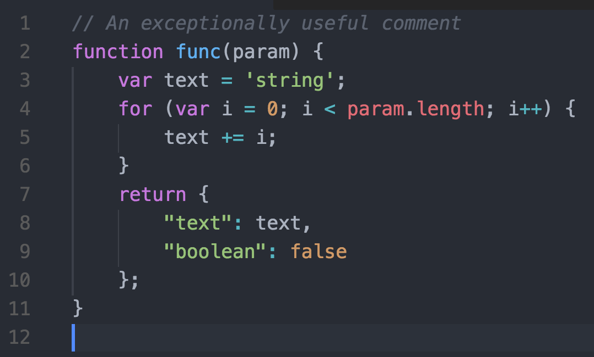
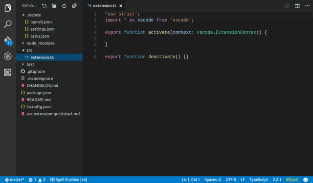
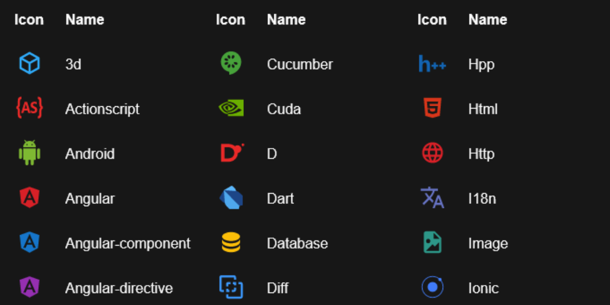
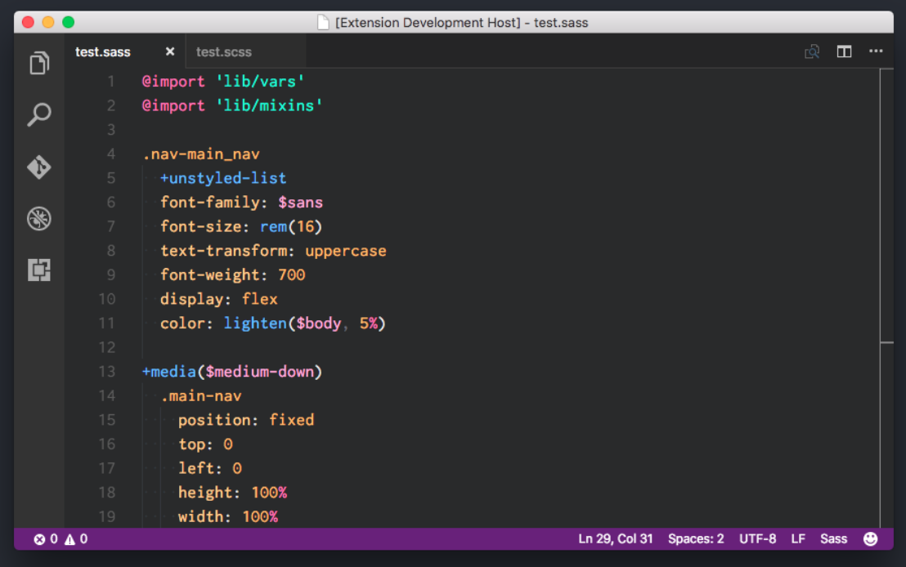
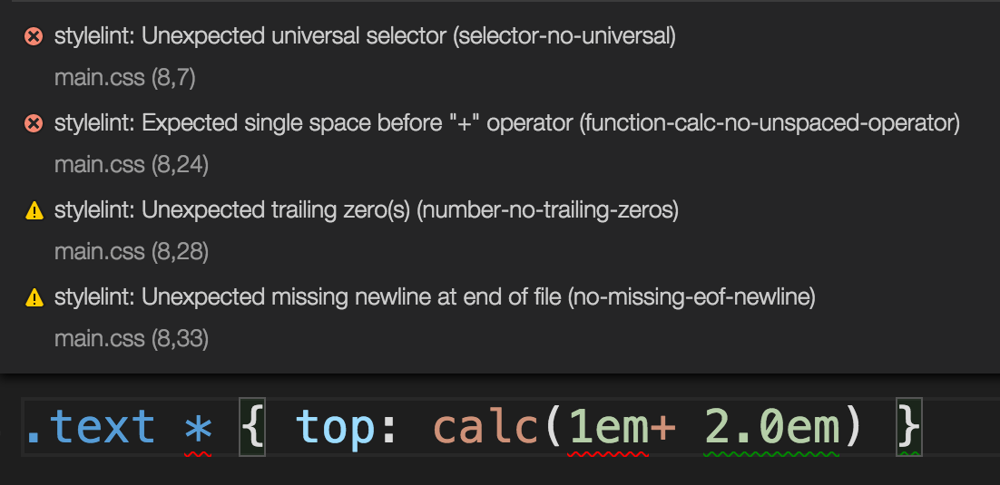

# Extensions

**Sublime Text Keymap and Settings Importer**\
This extension imports keybindings and settings from Sublime Text to VS Code. This cuts the learning curve if you're switching from SublimeText into VS Code. However, if VS Code is your first editor and you're&#x20;


I'm very much used to the keyboard shortcuts using&#x20;


**One Dark Pro**\
****Atom's iconic One Dark theme for Visual Studio Code



**Auto Rename Tag**\
****Auto rename paired html tags


**CSS Peak**\
****Allow you to peak on CSS classes directly on the HTML markup


**File Utils**\
****A more convenient way of creating, duplicating, moving, renaming and deleting files



**IntelliSense for CSS class names in HTML**\
Provides CSS class name completions for the HTML `class` attribute based on the definitions found in your workspace or external files referenced through the `link element`


**Material Icon Theme**\
****Adds material icons to opened tabs and items in the Explorer window



**Prettier - Code Formatter**\
****VS Code package to format your JavaScript / TypeScript / CSS using [Prettier](https://github.com/prettier/prettier).

Manually running prettier from the command palette (cmd+shift+p)

```
1. CMD + Shift + P -> Format Document
OR
1. Select the text you want to Prettify
2. CMD + Shift + P -> Format Selection
```

Or running it automatically on every save, add this to your preferences

```
// Set the default
"editor.formatOnSave": false,
// Enable per-language
"[javascript]": {
    "editor.formatOnSave": true
}
```

**Sass**\
****VS Code has built-in support for SCSS syntax, this will add support for SASS syntax



**stylelint**\
****A [Visual Studio Code](https://code.visualstudio.com/) extension to lint [CSS](https://www.w3.org/Style/CSS/)/[SCSS](https://sass-lang.com/documentation/file.SASS\_REFERENCE.html#syntax)/[Less](http://lesscss.org/) with [stylelint](https://stylelint.io/)



**Trailing Spaces**\
****A [VS Code](https://code.visualstudio.com/) extension that allows you to highlight trailing spaces and delete them in a flash!
