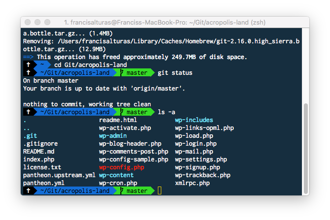

# iTerm2

[iTerm2](http://www.iterm2.com/) is a replacement for Terminal and the successor to iTerm \(And a super successor to the default Terminal in OSX\). It's highly customizable and comes with a lot of useful features.



## Installation

You can download the app from [here](http://www.iterm2.com/). Once downloaded, drag and drop the **iTerm** application file into your **Applications** folder. Or using Homebrew:

```text
brew cask install iterm2
```

## iTerm Color Schemes

You can actually get alot of different iTerm color schemes [here](https://github.com/mbadolato/iTerm2-Color-Schemes/tree/master/schemes) or customize you're own. My personal favourite is the [Cobalt2 iTerm theme](https://github.com/wesbos/Cobalt2-iterm/blob/master/cobalt2.itermcolors). \(We'll come back to customizing this after installing Oh My Zsh!\)

## Terminologies

**Console:** This is the system as a whole. This is both the command line as well as the output from previous commands.

**Command Line:** This is the actual line in a console where you type your command.

**Prompt:** This is the beginning of the command line. It usually provides some contextual information like who you are, where you are and other useful info. It typically ends in a **$**. After the prompt is where you will be typing commands.

**Terminal:** This is the actual interface to the console. The program we use to interact with the console is actually a “terminal emulator”, providing us the experience of typing into an old school terminal from the convenience of our modern graphical operating system.

**Text CLI shells:** Basically is a user interface for accessing OS services. Examples are Bourne-Again Shell \(Bash\), z Shell \(zsh\) Korn shell \(kshell\)

