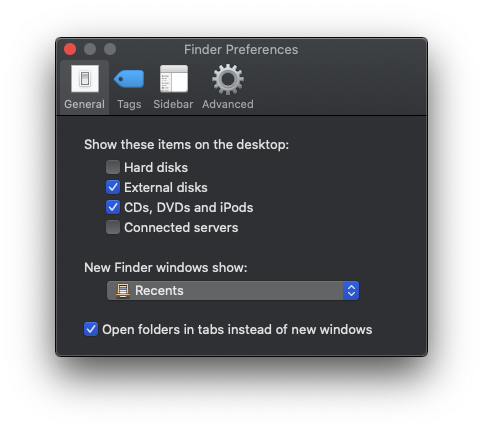

# Finder

## Preferences

Open **Finder** &gt; **Preferences**

* General

  * [ ] Show these items on the desktop &gt; **Uncheck everything**
  * [ ] New Finder windows show &gt; **Desktop**
  * [ ] Make sure to check **Open folders in tabs instead of new windows**

  \*\*\*\*

* Tags

  * [ ] Show these tags in the sidebar &gt; **Uncheck everything**

  \*\*\*\*

* Sidebar 
  * Uncheck everything except:
    * [ ] Applications
    * [ ] Desktop
    * [ ] Downloads
    * [ ] Home Directory 

## Modifying the Sidebar

* [ ] Add your our code repo directory \(ex. creating a **Git folder** in your home/root directory then adding it here as a shortcut\) 
* [ ] Add your team Google Drive Folder

