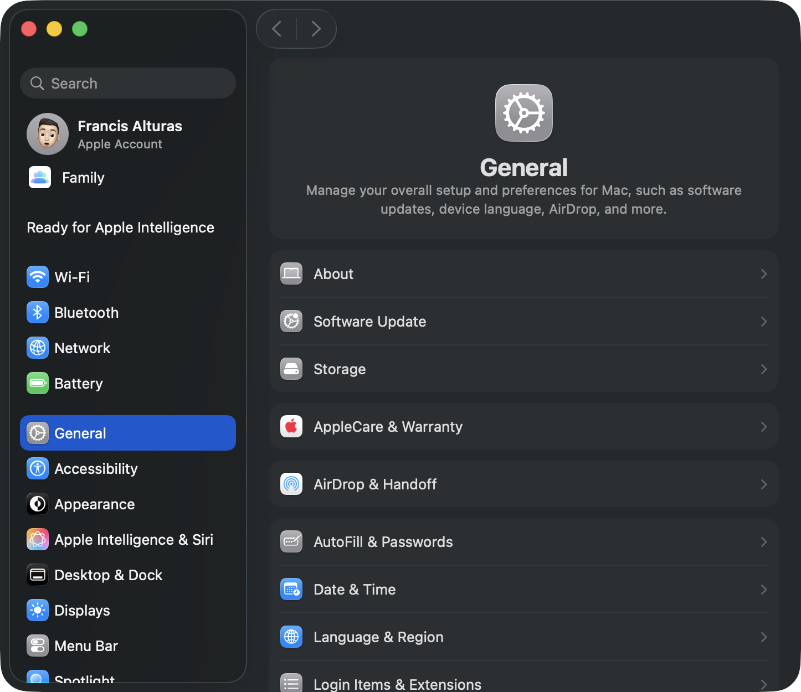

# Finder Settings

### Settings

Open **Finder** → **Settings:**

<figure><figcaption></figcaption></figure>

#### **General**&#x20;

* Uncheck everything under: **Show these items on the desktop**
* **New Finder windows show** → Select **Desktop**

#### **Tags**

* Uncheck everything

#### Sidebar

* Uncheck everything except:
  * **Applications**
  * **Desktop**
  * **Downloads**
  * **francisalturas** (or whatever is your computer name)
  * **Francis's MacBook Pro**
  * **Airdrop**

***

### Finder Sidebar Recommendations

* Add your code directory as a shortcut (e.g., create a **Git** folder in your home directory)
* Add your team **Google Drive Folder** as a shortcut

