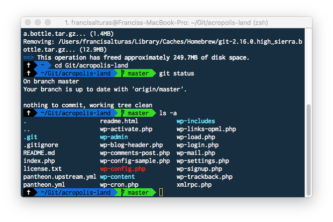

# iTerm2 Setup

[iTerm2](http://www.iterm2.com/) is a highly customizable terminal emulator and comes with a lot of useful features. This setup is heavily based on [Wesbos](https://twitter.com/wesbos) setup and Cobalt theme



### Installation

You can download the app from [here](http://www.iterm2.com/). Once downloaded, drag and drop the **iTerm** application file into your **Applications** folder. Or feel like a pro on the command-line using Homebrew:

```text
brew cask install iterm2
```

## Theme

You can actually get alot of different iTerm color schemes [here](https://github.com/mbadolato/iTerm2-Color-Schemes/tree/master/schemes) or customize you're own. My personal favourite is the [Cobalt2 iTerm theme](https://github.com/wesbos/Cobalt2-iterm/blob/master/cobalt2.itermcolors). \(We'll come back to customizing this after installing Oh My Zsh!\)

## 

