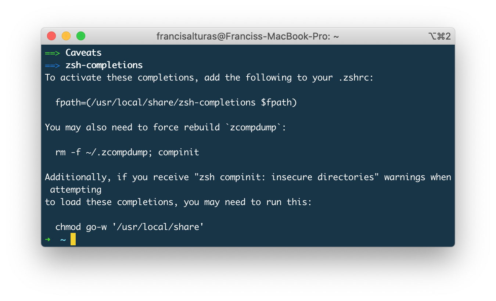
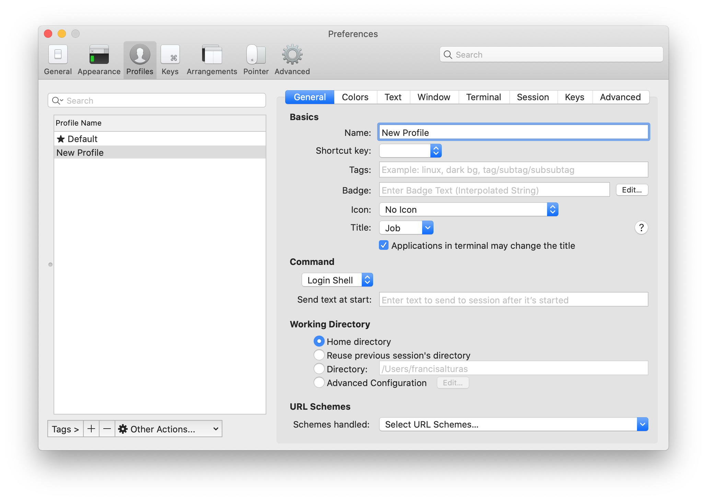
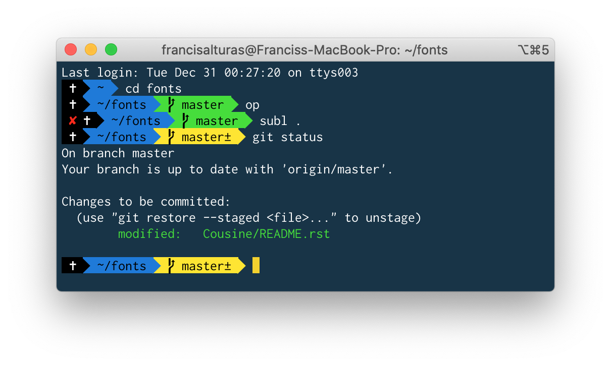

# Zsh


Announced in June and released in October 2019, [macOS Catalina](https://en.wikipedia.org/wiki/MacOS_Catalina) has adopted Zsh as the default shell, replacing [Bash](https://en.wikipedia.org/wiki/Bash_%28Unix_shell%29). Although the copy of zsh available on macOS by default is that one that shipped with the system, it will eventually get out of date. So the first thing to do is to install the latest version, with Homebrew.


So that means - no need to manually install Zsh anymore! 🥳

Install zsh and zsh-completions using Homebrew:

```text
brew install zsh zsh-completions
```

Upon completing installation, you'll probably come across this message:



What we'll need to do is to add `fpath=(path/to/zsh-completions/src $fpath)` to our **.zshrc** file. However, it will still get overwritten when we install Oh-My-Zsh \(Which I'll explain later, so let's go back to this in the next step\) 

Now let's use a framework built on top of this shell called **Oh My Zsh!**

## Install Oh My Zsh!

Install [Oh My Zsh](http://ohmyz.sh/) on top of zsh to get additional functionality and super-charge your terminal!

```text
sh -c "$(curl -fsSL https://raw.github.com/ohmyzsh/ohmyzsh/master/tools/install.sh)"
```

#### Resolving the issue from the previous step

Let's open **.zshrc** file using Sublime Text

```text
subl ~/.zshrc
```

Then copy paste this text, and save the file:

```text
fpath=(path/to/zsh-completions/src $fpath)
```

And go back to the terminal and run this:

```text
rm -f ~/.zcompdump; compinit
```

## Plugins

You can further extend zsh's power and functionalities by adding plugins to Oh My Zsh. There are useful plugins like completion plugins ****that will let `zsh` know which arguments the package has so it can autocomplete. We can do so by adding this to our .zshrc file

**What is a .zshrc file?** Basically it's its a Z-shell resource which contains all your configurations.

### How do I edit / access the .zshrc file?

Your .zshrc file is usually located at the root. To open it up using your default text editor:

```text
open ~/.zshrc
```

### **How to add plugins?**

To add plugin we need to search and add these strings of text to our current plugins list in the .**zshrc file**

```text
plugins=(
  git osx extract python ruby rails node npm
)
```

You can also manually select things you want to add from [this plugins list](https://github.com/robbyrussell/oh-my-zsh/wiki/Plugins).

Aside from that, there are also plugins that goes beyond autocompleting - [check this list](https://github.com/robbyrussell/oh-my-zsh/wiki/Plugins-Overview) out. One of my picks are **extract** - for extracting zips in the terminal. This really depends on what you use/need so feel free to customize.

## Homebrew Stuff To Do

One thing we need to do is tell the system to use programs installed by Homebrew \(in `/usr/local/bin`\) rather than the OS default if it exists. We do this by adding`/usr/local/bin`to your`$PATH`environment variable.

Now that we've already installed Oh My Zsh! This command will append the text `PATH="/usr/local/bin:$PATH"` on the .zshrc file

```text
echo export PATH="/usr/local/bin:$PATH" >> ~/.zshrc
```

## iTerm Color Schemes

Open iTerm, go to **Preferences &gt; Profiles** and create your own color scheme! 

My personal favorite is the [Cobalt2 iTerm theme](https://github.com/wesbos/Cobalt2-iterm/blob/master/cobalt2.itermcolors). To use it:

1. Download [cobalt2.itermcolors](https://raw.githubusercontent.com/wesbos/Cobalt2-iterm/master/cobalt2.itermcolors)
2. Go to **Preferences &gt; Profiles** and click on the "**+**" button to add a new profile.
3. Give it a name, and click on the **Colors** tab
4. Import **cobalt2.itermcolors** by clicking on the **Color Presets..** &gt; **Import..**
5. After importing, select **Color Presets..** &gt; **cobalt2**



## Oh My Zsh Themes

While there are [alot of themes](https://github.com/robbyrussell/oh-my-zsh/wiki/themes) you can use with Oh My Zsh, my favourite is the [Cobalt2 theme](https://github.com/wesbos/Cobalt2-iterm). You can click on the theme link and follow the instructions there or follow thru here:

1. Open & edit your .zshrc file with `$ open .zshrc` then search & modify the following line `$ ZSH_THEME="cobalt2"`
2. Copy & paste the [cobalt2.zsh-theme](https://raw.githubusercontent.com/wesbos/Cobalt2-iterm/master/cobalt2.zsh-theme) file to `~/.oh-my-zsh/themes/`  directory

## Powerline

What are ****[**Powerline**](https://github.com/powerline/powerline)? It's a statusline plugin for vim, and provides statuslines and prompts. And along with it are [**Powerline Fonts**](https://github.com/powerline/fonts) that is responsible for the icons you have on your terminal. To enable powerline fonts on the theme we're using:

Powerline uses Pip \(Which is a package manager for Python\) Unfortunately, 

* Install **Powerline**

```text
pip3 install --user powerline-status
```

* Clone the [Powerline fonts](https://github.com/powerline/fonts) and run `install.sh` to install all powerline fonts

```text
git clone https://github.com/powerline/fonts
cd fonts
./install.sh
```

Now head back to iTerm and go to **Preferences** &gt; **Profiles** &gt; **Text** and change the font family to **Inconsolata for Powerline**, font weight to **Medium** and set the font size to **12px**. Then you should be seeing icons in your command prompt like this:




You can play around with the size, change the powerline font - up to you guys 😄


Then refresh zsh by typing `source ~/.zshrc` or by restarting your terminal

## Shortcuts

`ctrl + a` to move at the beginning of the line

`ctrl + e` to move at the end of the line

`ctrl + u` to clear the current line

`ctrl + k` to clear all the characters that precedes the cursor position

`ctrl + l` to clear the screen

## Frequently Asked Questions

**There's these weird \[?\] symbols on my terminal.** Probably missing the [powerline fonts](https://github.com/powerline/fonts)

**Where are my zsh settings stored?** `.zshrc`file located in your home directory. It’s a hidden file, so you might not see it in your home directory, but you can view it by running `open ~/.zshrc`from the terminal. Swap out `open`with your favorite editor command, such as `nano`, `subl`or `vim`. \(these are text editors, `nano` for [GNU Nano](https://www.nano-editor.org/), `subl` for [Sublime Text](https://www.sublimetext.com/), and `vim` for [Vim](http://www.vim.org/)\)

**It's not working!** Did you carefully follow the instructions? Also try restarting your terminal for it to take effect.

**I have no idea how to use the terminal / So hard to follow the instructions!** I suggest taking [this great course](https://commandlinepoweruser.com) by Wesbos.  
  
**When I open my terminal this message shows up:**`compdef: unknown command or service: rails`  
  
Just run this and it should be working fine:

```text
rm -f ~/.zcompdump*; compinit 
```

