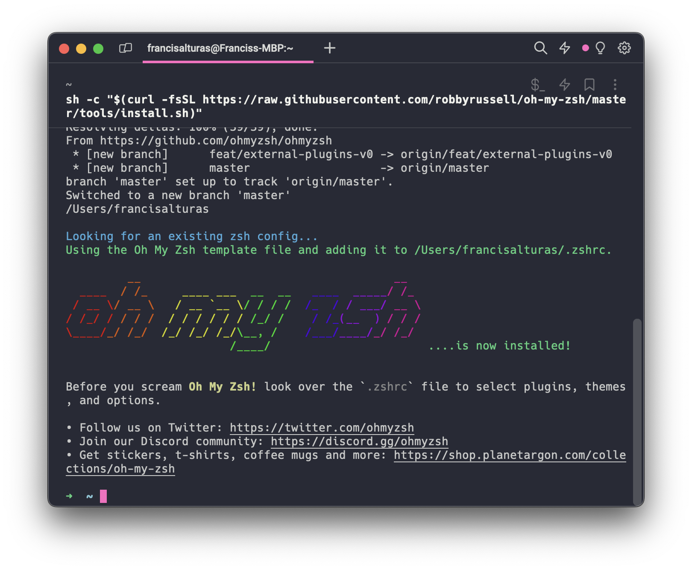

# Warp Setup

Before we proceed, there are three main things that we want to set up in a terminal. Mainly, the **Theme**, **Prompt, and shell.**

Lately, I've been using Warp — which is a nice terminal with AI built in. It boasts shared workflows and saved commands so you can collaborate with your team better. You can check it out here: [https://www.warp.dev/](https://www.warp.dev/)

To install, simple run: `brew install --cask warp`

<figure><figcaption></figcaption></figure>

## Theme

I love **hyper snazzy**, which is an elegant terminal theme with bright colors. Luckily they made a port for Warp here: [https://github.com/GrimLink/warp-theme-snazzy](https://github.com/GrimLink/warp-theme-snazzy)

Download the `snazzy.yaml` file (and any other accent file) and copy it to `~/.warp/themes`

Make sure you use the **Menlo** font.&#x20;

## Shell

### **Zsh**

Since macOS Catalina and higher, Zsh has been adopted replacing Bash. So no need to manually install zsh anymore. If you're not sure you can run `echo "$SHELL"` on your terminal and you should get `/bin/zsh` as a response.

### **Zsh Framework**

**Oh-my-zsh** is an open source, community-driven framework for managing your zsh configuration [http://ohmyz.sh/](http://ohmyz.sh/)

#### Installation:

```
sh -c "$(curl -fsSL https://raw.githubusercontent.com/robbyrussell/oh-my-zsh/master/tools/install.sh)"
```

## Prompt

**Pure** is a pretty, minimal, and fast ZSH prompt [https://github.com/sindresorhus/pure](https://github.com/sindresorhus/pure)

But you'll need node installed first:

```
brew install node
```

Then, to install:

```
npm install --global pure-prompt
```

And add this to the end of your `~/.zshrc`

```
# .zshrc
autoload -U promptinit; promptinit
prompt pure
```


### **FAQ**

**What is a .zshrc file?** Basically, it's a Z-shell resource that contains all your configurations.

#### How do I edit/access the .zshrc file?

Your .zshrc file is usually located at the root. To open use your default text editor:

```
open ~/.zshrc
```

**Big Sur Issue: After installing Brew, I get a "command not found"**

Simply open your .zshrc file and add this:

`export PATH=/opt/homebrew/bin:$PATH`


## Zsh Plugins

### Zsh autosuggestions

[zsh-autosuggestions](https://github.com/zsh-users/zsh-autosuggestions) is a [Fish](http://fishshell.com/)-like fast/unobtrusive auto-suggestions for zsh. It suggests commands as you type based on command history.

#### **Installation**:

```
git clone https://github.com/zsh-users/zsh-autosuggestions.git $ZSH_CUSTOM/plugins/zsh-autosuggestions
```

Search for the `plugins` line inside `~/.zshrc` and add the plugin to the list of plugins for Oh My Zsh to load

```
plugins=(git zsh-autosuggestions)
```

###

### Zsh Syntax Highlighting

[zsh-syntax-highlighting](https://github.com/zsh-users/zsh-syntax-highlighting) is a Fish shell-like syntax highlighting for Zsh.

#### Installation:

```
git clone https://github.com/zsh-users/zsh-syntax-highlighting.git ${ZSH_CUSTOM:-~/.oh-my-zsh/custom}/plugins/zsh-syntax-highlighting
```

Then again, search for the `plugins` line inside `~/.zshrc` and add the plugin to the list of plugins for Oh My Zsh to load

```
plugins=(git zsh-autosuggestions zsh-syntax-highlighting)
```

\
You need to `source` your config

```
source ~/.zshrc
```
